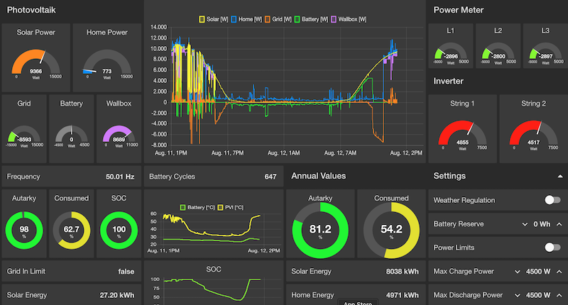

# Dashboard for an E3/DC Home Power Station
[](https://github.com/pvtom/rscp2mqtt-dashboard/)
[](https://github.com/pvtom/rscp2mqtt-dashboard/releases/latest)
[](https://github.com/pvtom/rscp2mqtt-dashboard/commits)
[](https://github.com/pvtom/rscp2mqtt-dashboard/issues)
[](https://github.com/pvtom/rscp2mqtt-dashboard/pulls)
[](https://github.com/pvtom/rscp2mqtt-dashboard/blob/main/LICENSE)

The dashboard visualizes data from a home power station by subscribing to MQTT topics published by [rscp2mqtt](https://github.com/pvtom/rscp2mqtt).



## Docker

Instead of installing the package, you can simply use an existing [Docker image](DOCKER.md).

## Prerequisites

- a running rscp2mqtt instance (https://github.com/pvtom/rscp2mqtt), v3.8 or higher
- an existing MQTT broker
- an installation of Node-RED (https://nodered.org)
  including the modules "node-red-dashboard" and "node-red-contrib-aggregator" or
- a Docker environment on your system

## Installation of the package

Please follow the installation steps on the Node-RED homepage.

## Load the flow

Import the file dashboard_flow.json, adjust the broker settings in one of the mqtt nodes and deploy the changes

or

set the parameters as environment variables and start the prepare script (i.e. with bash):

```
export MQTT_BROKER="localhost"
export TOPIC_PREFIX="e3dc"

cp -a flows.json.template flows.json

./prepare.sh flows.json
```

afterwards import flows.json into NODE-RED.

These parameters are available to configure MQTT settings:

- MQTT_BROKER
- MQTT_PORT
- MQTT_CLIENT_ID
- MQTT_USER
- MQTT_PASSWORD
- TOPIC_PREFIX

Value ranges can be adjusted with the following parameters:

- MAX_SOLAR_POWER
- MAX_HOME_POWER
- MAX_GRID_POWER
- MAX_BATTERY_POWER
- MAX_STRING_POWER
- MAX_PHASE_POWER
- MAX_BATTERY_RESERVE

## Access the dashboard

The dashboard will be accessible at http://<your_node_red_host>:1880/ui

The chart data is collected over the next 24 hours.
